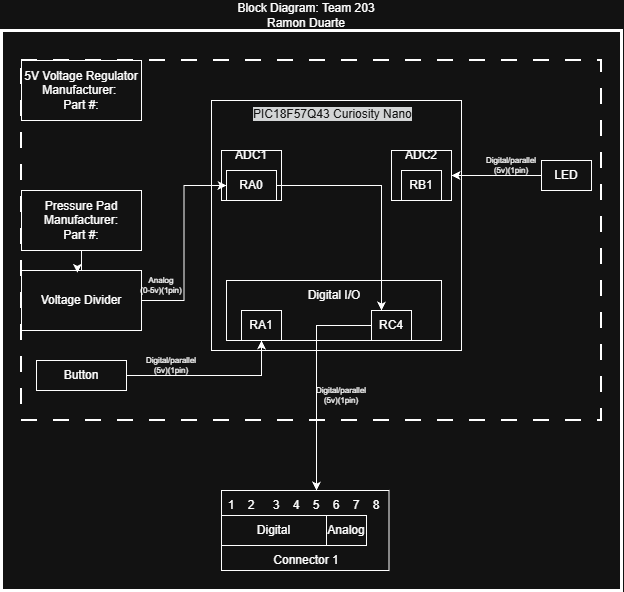

## Overview
This block Diagram illustrates the system and how it is connected. It shows what is needed in order for the system to function for example, the input voltage from the voltage regulator as well as how the Pressure pad and other sub-systems like the onboard LED and push-button are connected to the Curiosity Nano board. Finally it illustrates how the system will communicate with the other systems in the project by showing which pins are being used.

## Block Diagram 

